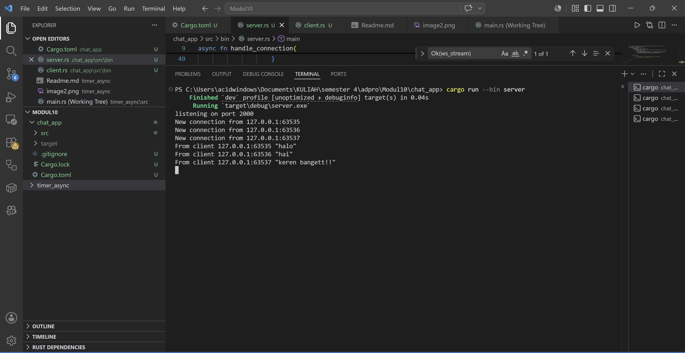
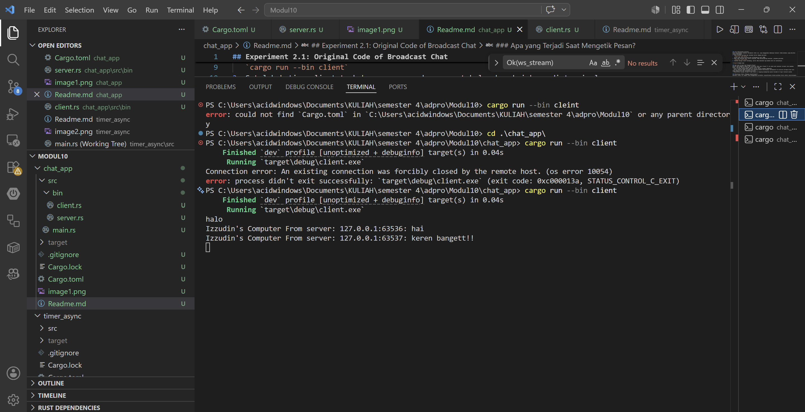
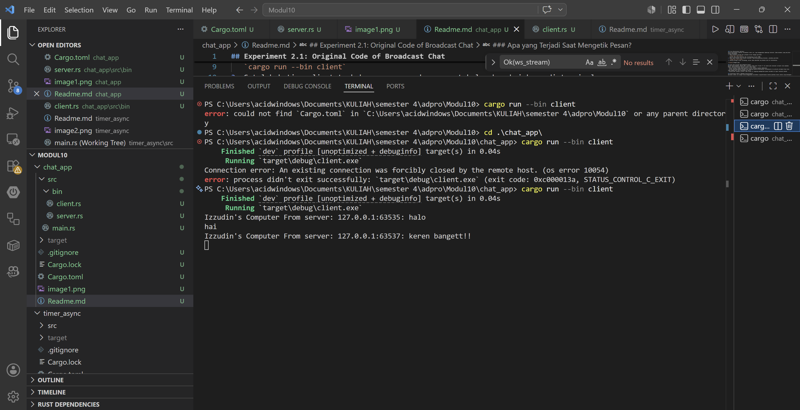
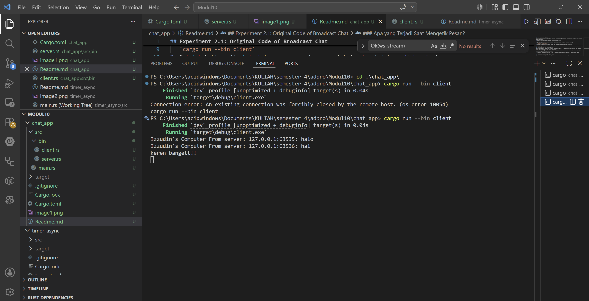
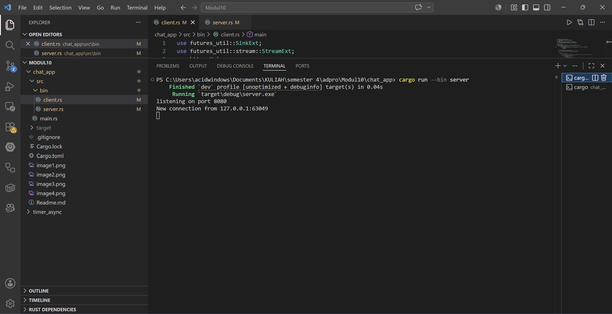

## Experiment 2.1: Original Code of Broadcast Chat

### Cara Menjalankan Aplikasi
Untuk menjalankan simulasi *broadcast chat* ini, saya menggunakan beberapa terminal (tabs/windows) yang berjalan secara bersamaan:
1. Buka terminal pertama dan jalankan server dengan perintah:
   `cargo run --bin server`
   Server akan mulai berjalan dan *listening* di port 2000.
2. Buka tiga terminal baru secara terpisah. Pada masing-masing terminal, jalankan perintah:
   `cargo run --bin client`
3. Setelah ketiga client terhubung, server akan mencetak log koneksi baru di terminalnya.

### Apa yang Terjadi Saat Mengetik Pesan?
Ketika saya mengetik sebuah teks di salah satu terminal *client* lalu menekan Enter, hal-hal berikut terjadi secara *real-time*:
- Klien tersebut mengirimkan pesan ke server melalui koneksi WebSocket.
- Server menerima pesan tersebut dan langsung mendistribusikannya (*broadcast*) ke seluruh *stream* klien lain yang sedang aktif dan terhubung ke server.
- Klien-klien lainnya (Client 2 dan Client 3) langsung menampilkan pesan tersebut di layar terminal mereka

### Penjelasan Teknis (Mengapa Asynchronous?)
Aplikasi *chat* ini sangat cocok menggunakan arsitektur *asynchronous* karena aplikasi harus selalu siap merespons berbagai *event* yang bisa terjadi kapan saja tanpa saling memblokir (*blocking*). Di sini, kita menggunakan *macro* `tokio::select!` untuk menangani konkurensi:
- **Di sisi Server:** `tokio::select!` memungkinkan server untuk secara konkuren memantau pesan masuk dari klien (via `WebSocketStream`) dan pesan keluar dari *channel broadcast* (via `Receiver`). Siapa pun yang datanya *ready* lebih dulu akan dieksekusi.
- **Di sisi Client:** `tokio::select!` digunakan dalam *loop* tanpa henti untuk memantau input ketikan pengguna dari *keyboard* (`stdin.next_line()`) sekaligus memantau pesan masuk dari server (`ws_stream.next()`). Jika kita menggunakan pendekatan *synchronous* biasa, program akan tertahan menunggu input pengguna (menunggu *Enter*) dan tidak bisa menampilkan pesan baru dari server hingga pengguna selesai mengetik. Dengan *async*, keduanya berjalan independen secara bersamaan.

## Experiment 2.2: Modifying the Websocket Port

### Perubahan yang Dilakukan
Untuk mengubah *port* komunikasi WebSocket dari `2000` menjadi `8080`, ada dua titik yang harus disesuaikan karena arsitektur ini berbasis *client-server*:
1. **Sisi Server (`src/bin/server.rs`):** Saya mengubah argumen pada `TcpListener::bind("127.0.0.1:8080").await?`. Ini menginstruksikan server untuk membuka dan mendengarkan (*listen*) koneksi TCP yang masuk secara spesifik pada *port* 8080.
2. **Sisi Client (`src/bin/client.rs`):** Saya mengubah target URI pada `ClientBuilder::from_uri(Uri::from_static("ws://127.0.0.1:8080"))`. Hal ini memastikan klien melakukan proses *handshake* WebSocket ke alamat IP dan *port* server yang baru.

Keduanya menggunakan protokol `ws://` yang menandakan koneksi WebSocket standar tanpa enkripsi.

